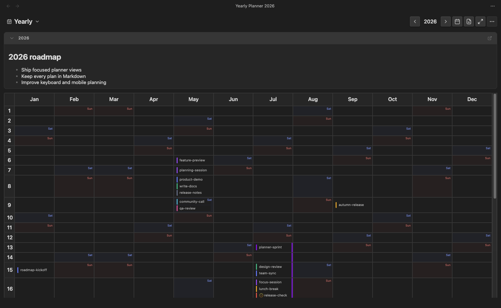
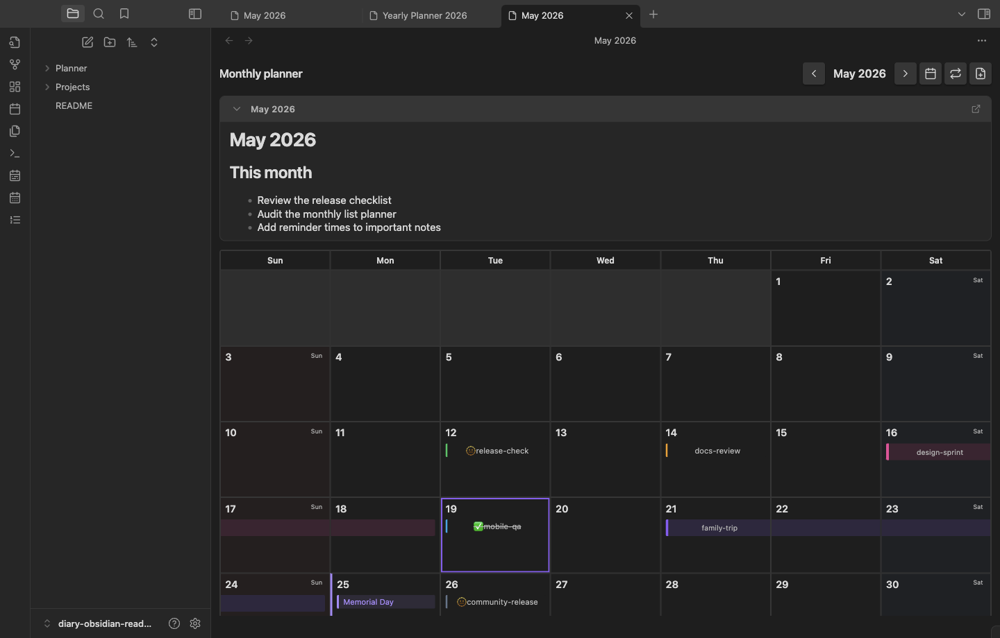
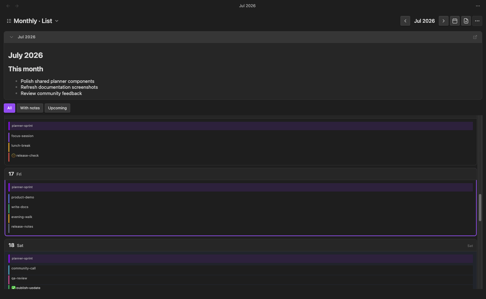
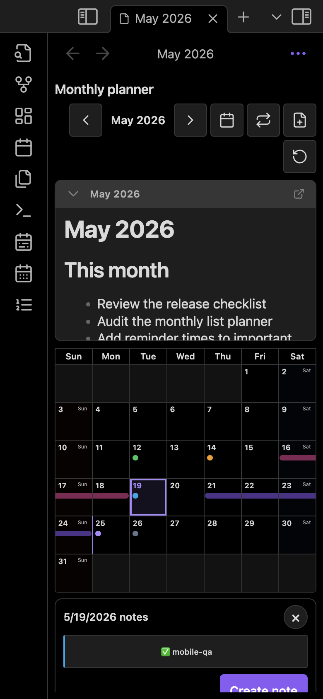
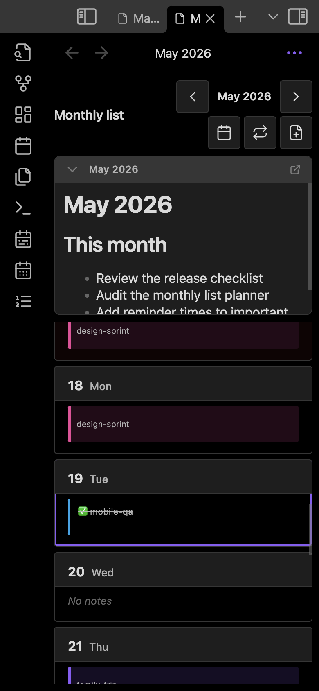

# Diary (한국어)

Diary는 Obsidian vault 안의 Markdown 파일을 날짜 기반 플래너로 보여주는 커뮤니티 플러그인입니다. 연간 개요, 월간 그리드, 월간 목록을 오가며 단일 날짜 노트, 기간 노트, 월/연 플랜 노트, 공휴일, todo 상태, 로컬 알림을 한 곳에서 관리할 수 있습니다.

English documentation: [docs/en/README.md](../en/README.md)

## 현재 정보

| 항목 | 값 |
| --- | --- |
| 플러그인 ID | `diary` |
| 현재 버전 | `1.0.10` |
| 최소 Obsidian 버전 | `1.7.2` |
| 지원 플랫폼 | 데스크톱 / 모바일 (`isDesktopOnly: false`) |
| 기본 언어 | `en` |
| 기본 플래너 폴더 | `Planner` |

## 스크린샷

아래 이미지는 README 설명을 위해 새 데모 vault에 샘플 플래너 노트를 만든 뒤 캡처했습니다. 모바일 이미지는 데모 vault에서 모바일 렌더링 분기를 사용해 모바일 폭으로 촬영했습니다.

### 데스크톱







### 모바일

| 월간 그리드와 일자 요약 | 월간 목록 |
| --- | --- |
|  |  |

## 주요 기능

- **연간 플래너**: `12개월 x 31일` 표로 한 해의 날짜 노트와 기간 노트를 한눈에 봅니다.
- **월간 그리드 플래너**: 한 달 달력을 크게 보고 날짜별 칩, 기간 막대, 공휴일을 확인합니다.
- **월간 목록 플래너**: 하루씩 세로로 훑으며 일정이 많은 달을 검토합니다.
- **플랜 노트 패널**: 연간 노트(`YYYY.md`)와 월간 노트(`YYYY-MM.md`)를 플래너 상단에서 만들고 미리 봅니다.
- **날짜/기간 노트**: 날짜 파일명과 기간 파일명을 기준으로 노트를 플래너 칩으로 표시합니다. 기본값은 vault 전체 스캔이며, 설정에서 플래너 폴더 안으로만 제한할 수 있습니다.
- **색상, todo, 완료 상태**: frontmatter의 `color`, `todo`, `completed` 값을 칩 스타일과 라벨에 반영합니다.
- **공휴일 오버레이**: 국가별 공휴일을 표시하고 공휴일 배지를 선택해 이름을 확인합니다.
- **로컬 알림**: `notify_minutes`가 있는 날짜 노트는 Obsidian이 열려 있을 때 해당 날짜와 시간에 Notice를 표시합니다.
- **플래너 클립보드**: 데스크톱에서 선택한 날짜/노트를 복사, 붙여넣기, 삭제, 붙여넣기 취소할 수 있습니다.
- **모바일 최적화**: 월간 그리드에서 핀치 줌, 확대 초기화, 일자 요약 시트를 지원합니다.

## 설치

1. [Releases](https://github.com/POBSIZ/obsidian-diary/releases)에서 최신 릴리스를 다운로드합니다.
2. `main.js`, `manifest.json`, `styles.css`를 vault의 `Vault/.obsidian/plugins/diary/` 폴더에 복사합니다.
3. Obsidian에서 **Settings -> Community plugins**를 엽니다.
4. Restricted mode가 켜져 있다면 신뢰하는 vault에서만 끄고, **Diary**를 활성화합니다.
5. 왼쪽 리본 아이콘 또는 커맨드 팔레트에서 플래너를 엽니다.

## 빠른 시작

1. **Open monthly planner** 명령을 실행합니다.
2. 상단의 파일 추가 버튼을 선택하거나 날짜 셀을 선택합니다.
3. **Single date** 또는 **Range**를 고릅니다.
4. 폴더, 날짜, 파일 이름, 색상, todo 여부, 알림 시간을 입력합니다.
5. **Create**를 선택하면 Markdown 노트가 만들어지고 플래너에 칩 또는 기간 막대로 표시됩니다.

생성된 노트는 일반 Markdown 파일입니다. 플러그인을 끄더라도 vault 안의 파일은 그대로 남습니다.

## 뷰 열기와 전환

리본 아이콘:

- `calendar-range`: 연간 플래너 열기
- `calendar-days`: 월간 그리드 플래너 열기
- `list-ordered`: 월간 목록 플래너 열기

커맨드 팔레트:

- `Open yearly planner`
- `Open monthly planner`
- `Open monthly list planner`

각 플래너 헤더의 반복 아이콘을 선택하면 같은 리프에서 다음 순서로 전환됩니다.

```text
Yearly -> Monthly Grid -> Monthly List -> Yearly
```

이전/다음 버튼으로 연도나 월을 이동하고, 달력 아이콘으로 현재 연도/월로 돌아갑니다. 연도 또는 월 표시 텍스트를 선택하면 직접 값을 입력할 수 있습니다.

## 노트 만들기

### 단일 날짜 노트

날짜 셀을 선택하거나 파일 추가 버튼을 선택한 뒤 **Single date**를 사용합니다.

- 기본 파일명은 `YYYY-MM-DD.md`입니다.
- 접미사를 붙이면 칩 제목으로 사용됩니다. 예: `2026-05-19-mobile-qa.md` -> `mobile-qa`
- 색상을 지정하면 칩 왼쪽 선이나 모바일 점 색상으로 표시됩니다.
- **Todo file**을 켜면 칩에 todo 상태가 표시됩니다.
- **Reminder time**을 입력하면 `notify_minutes` frontmatter로 저장됩니다.

### 기간 노트

데스크톱에서는 날짜 셀을 드래그해 범위를 선택하면 **Range** 모달이 열립니다. 모바일에서는 파일 추가 버튼을 선택한 뒤 **Range**를 고르고 시작일과 종료일을 직접 입력합니다.

- 파일명 형식은 `YYYY-MM-DD--YYYY-MM-DD.md`입니다.
- 접미사를 붙이면 기간 제목으로 사용됩니다. 예: `2026-05-21--2026-05-24-family-trip.md` -> `family-trip`
- 생성 시 `date_start`, `date_end` frontmatter가 자동으로 저장됩니다.
- 연간 플래너에는 세로 막대와 시작일 칩으로, 월간 그리드/목록에는 기간 막대로 표시됩니다.

### 플랜 노트

플래너 상단의 플랜 노트 패널에서 연간/월간 메모를 만들 수 있습니다.

- 연간 플랜 노트: `{plannerFolder}/{year}.md`
- 월간 플랜 노트: `{plannerFolder}/{year}-{month}.md`
- 패널은 접거나 펼칠 수 있으며 이 상태는 플러그인 데이터에 저장됩니다.
- 기존 플랜 노트가 있으면 미리보기와 열기 버튼이 표시됩니다.

## 노트 수정

플래너에 표시된 칩이나 기간 막대를 선택하면 파일 옵션 모달이 열립니다.

- 파일 경로 확인
- 표시 제목 변경
- 단일 날짜 또는 기간 날짜 변경
- 칩 색상 변경
- todo / completed 상태 변경
- 알림 시간 변경
- 파일 미리보기
- 파일 열기
- 파일 삭제

데스크톱에서는 날짜 칩 또는 기간 막대를 다른 날짜로 드래그해 이동할 수 있습니다. 기간 노트는 시작일이 이동하며 전체 기간 길이는 유지됩니다. 대상 경로에 이미 파일이 있으면 이동하지 않습니다.

## 플래너 클립보드 (데스크톱)

플래너 영역에서 `Cmd`(macOS) 또는 `Ctrl`(Windows/Linux)을 누른 채 날짜나 칩을 선택합니다.

Diary는 복사한 플래너 노트를 현재 Obsidian 세션의 내부 메모리 클립보드에 보관합니다. 시스템 클립보드를 읽거나 쓰지 않습니다.

- `Cmd/Ctrl + click`: 선택을 새로 지정합니다.
- `Cmd/Ctrl + Shift + click`: 기존 선택에 추가하거나 제거합니다.
- `Cmd/Ctrl + C`: 선택한 날짜/노트를 Diary 내부 클립보드에 복사합니다.
- `Cmd/Ctrl + V`: 선택한 대상 날짜에 붙여넣습니다.
- `Cmd/Ctrl + Delete` 또는 `Cmd/Ctrl + Backspace`: 선택한 플래너 노트를 휴지통으로 보냅니다.
- `Cmd/Ctrl + Z`: 마지막 붙여넣기 배치를 휴지통으로 보내 되돌립니다.

붙여넣기 규칙:

- 노트 1개를 여러 날짜에 붙여넣을 수 있습니다.
- 여러 노트는 날짜 1개에 붙여넣을 수 있습니다.
- 여러 노트를 여러 날짜에 동시에 붙여넣는 조합은 충돌을 피하기 위해 막습니다.
- 기존 파일이 있으면 `-copy`, `-copy2`처럼 고유 경로를 만듭니다.

## 모바일 사용법

- 월간 그리드에서 날짜를 탭하면 하단 일자 요약 시트가 열립니다.
- 요약 시트에서 해당 날짜의 단일 노트, 기간 노트, 공휴일을 확인합니다.
- **노트 만들기**를 선택해 해당 날짜의 새 노트를 만듭니다.
- 월간 그리드에서는 핀치 줌을 사용할 수 있습니다.
- 확대 초기화 버튼으로 월간 그리드 확대 비율을 되돌립니다.
- 설정의 **Mobile bottom padding**과 **Mobile cell width**로 모바일 여백과 셀 너비를 조정합니다.

## 설정

| 설정 | 설명 |
| --- | --- |
| Language | 플러그인 UI 언어입니다. 기본값은 `en`이며, `en`, `ko`를 지원합니다. |
| Planner folder | 새 플래너 노트와 플랜 노트를 만들 기본 폴더입니다. 스캔 범위를 플래너 폴더로 제한할 때도 사용합니다. 기본값은 `Planner`입니다. |
| Planner note scan scope | Diary가 플래너 노트를 vault 전체에서 찾을지, **Planner folder**와 그 하위 폴더에서만 찾을지 정합니다. 기본값은 `Entire vault`입니다. |
| Date format | 날짜 형식 저장값입니다. 현재 플래너 파일명은 `YYYY-MM-DD` 규칙을 사용합니다. |
| Show holidays | 공휴일 표시를 켜거나 끕니다. |
| Holiday country | 공휴일 국가입니다. `KR`, `US`, `JP`, `CN`, `GB`, `DE`, `FR`, `AU`, `CA`, `TW`, `None`을 지원합니다. |
| Mobile bottom padding | 모바일 플래너 하단 여백입니다. Obsidian 모바일 도구 영역에 가리지 않도록 조정합니다. |
| Mobile cell width | 모바일 연간 플래너의 월 셀 너비입니다. `0`이면 기본값을 사용합니다. |

## Frontmatter 참고

| 키 | 설명 |
| --- | --- |
| `color` | 칩 색상입니다. 유효한 CSS 색상 문자열을 사용할 수 있습니다. 예: `#22c55e`, `red`, `rgb(34, 197, 94)` |
| `todo` | `true`이면 todo 칩으로 표시됩니다. |
| `completed` | `todo: true`일 때 완료 상태를 표시합니다. |
| `notify_minutes` | 이벤트 날짜의 로컬 자정 기준 분입니다. `0`부터 `1439`까지 사용할 수 있습니다. 예: 오전 9시는 `540` |
| `date_start` | 기간 노트 생성/수정 시 자동 저장되는 시작일입니다. |
| `date_end` | 기간 노트 생성/수정 시 자동 저장되는 종료일입니다. |
| `title` | 파일명에서 제목을 추출할 수 없을 때 사용하는 표시 제목입니다. |

알림은 OS 수준 예약 알림이 아닙니다. Obsidian이 열려 있는 동안 플러그인이 약 15초 간격으로 확인하고, 이벤트 날짜의 해당 분에 Obsidian Notice를 표시합니다.

## 파일명 규칙

Diary는 기본적으로 vault 전체의 Markdown 파일을 스캔해 아래 파일명 규칙과 맞는 노트를 플래너에 표시합니다. 설정에서 스캔 범위를 **Planner folder**와 그 하위 폴더로 제한할 수 있습니다. 새로 만드는 노트는 기본적으로 **Planner folder**에 생성됩니다.

단일 날짜:

```text
2026-05-19.md
2026-05-19-mobile-qa.md
```

기간:

```text
2026-05-21--2026-05-24.md
2026-05-21--2026-05-24-family-trip.md
```

플랜 노트:

```text
2026.md
2026-05.md
```

표시 제목 우선순위:

1. 파일명 접미사
2. frontmatter `title`
3. 첫 번째 Markdown heading
4. 파일 basename

## 개발

```bash
npm install
npm run dev
```

프로덕션 빌드:

```bash
npm run build
```

Lint:

```bash
npm run lint
```

## 릴리스

- 릴리스 워크플로: `.github/workflows/release.yml`
- 릴리스 에셋: `main.js`, `manifest.json`, `styles.css`
- `manifest.json`의 `version`과 `versions.json`을 함께 갱신합니다.
- GitHub 릴리스 태그는 `manifest.json`의 버전과 정확히 같아야 하며, 앞에 `v`를 붙이지 않습니다.

## 개인정보와 네트워크

- 플래너 기능은 vault 안의 로컬 Markdown 파일을 기준으로 동작합니다.
- 숨겨진 telemetry나 analytics가 없습니다.
- 공휴일 계산은 번들된 의존성을 사용하며, 플래너 표시를 위해 vault 내용을 외부 서비스로 보내지 않습니다.

## 문제 해결

- 플러그인이 보이지 않으면 `main.js`, `manifest.json`, `styles.css`가 `Vault/.obsidian/plugins/diary/` 바로 아래에 있는지 확인합니다.
- 명령이 보이지 않으면 **Settings -> Community plugins**에서 **Diary**가 활성화되어 있는지 확인합니다.
- 칩이 표시되지 않으면 파일명이 `YYYY-MM-DD` 또는 `YYYY-MM-DD--YYYY-MM-DD` 규칙을 따르는지 확인합니다.
- 모바일에서 표 하단이 가려지면 **Mobile bottom padding** 값을 키웁니다.
- 알림이 오지 않으면 Obsidian이 열려 있는지, 노트의 이벤트 날짜가 오늘인지, `notify_minutes` 값이 `0-1439` 범위인지 확인합니다.

## 라이선스

`LICENSE` 파일을 참고하세요.
